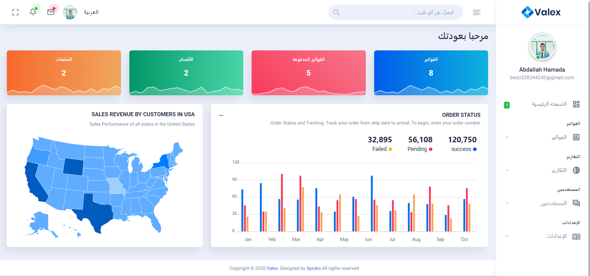

# Invoices system
### bulit in laravel 10

how to run
- serve project by typing (`composer install`) in terminal
- run mysql database
- php artisan db:seed
- serve project by typing (`php artisan serve`) in terminal
- use [`admin@gmail.com`] as email for login
- use [`admin@admin`] as password 

